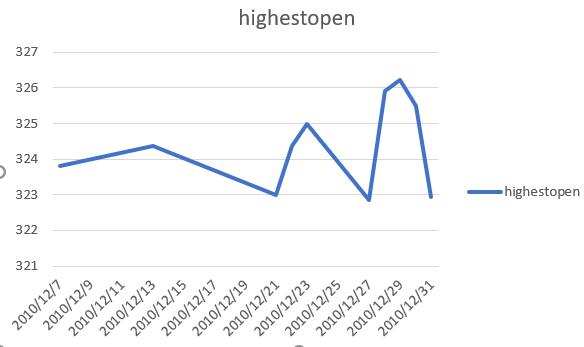
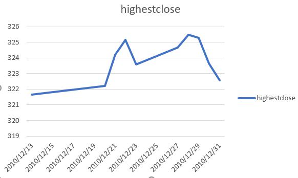
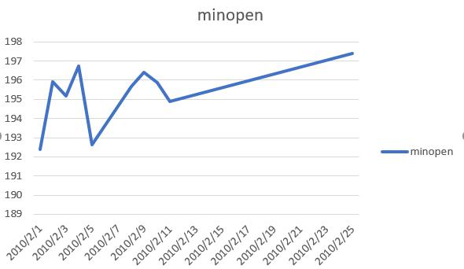
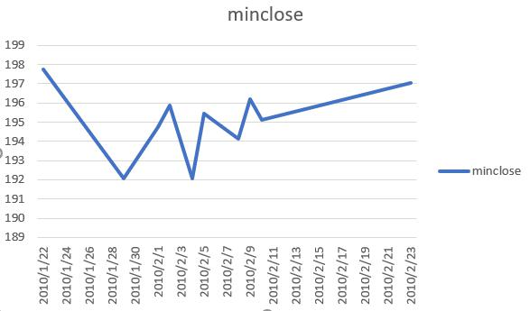
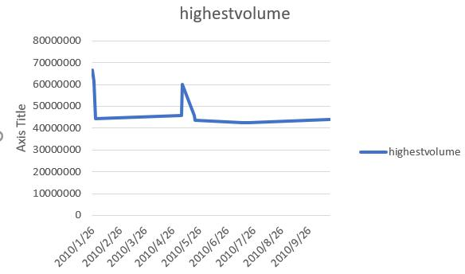

# datasets.aapl_historical_stock_price

# Description
Apple stock price highest and lowest open and close price

## Question 1
Which 10 dates have the highest open stock price in 2010?
```sql
SELECT date,
max(open) as Highestopen
From datasets.aapl_historical_stock_price
where year = 2010
group by date
order by Highestopen DESC
limit 10
```


## Question 2
Which 10 dates have the highest close stock price in 2010?
```sql
SELECT date,
max(close) as Highestclose
From datasets.aapl_historical_stock_price
where year = 2010
group by date
order by Highestclose DESC
limit 10
```


## Question 3
Which 10 dates have the lowest open stock price in 2010?
```sql
SELECT date,
min(open) as Minopen
From datasets.aapl_historical_stock_price
where year = 2010
group by date
order by Minopen ASC
limit 10
```


## Question 4
Which 10 dates have the lowest close stock price in 2010?
```sql
SELECT date,
min(close) as Minclose
From datasets.aapl_historical_stock_price
where year = 2010
group by date
order by Minclose ASC
limit 10
```


## Question 5
Which 10 dates have the highest volume in 2010?
```sql
SELECT date,
max(volume) as Highestvolume
From datasets.aapl_historical_stock_price
where year = 2010
group by date
order by Highestvolume DESC
limit 10
```

